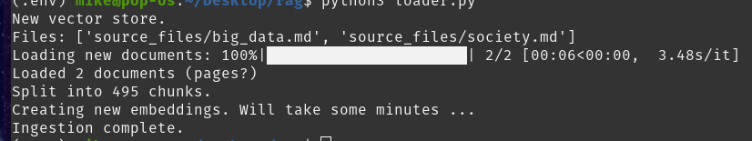
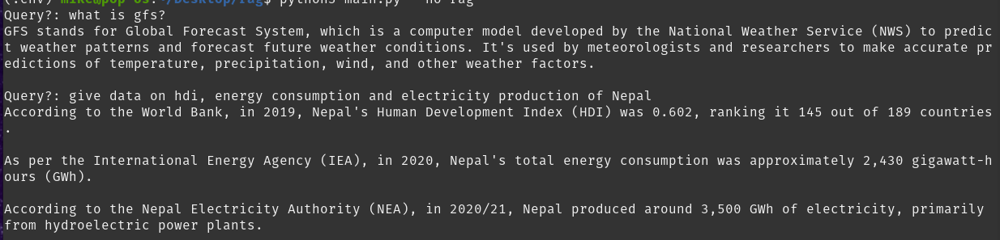
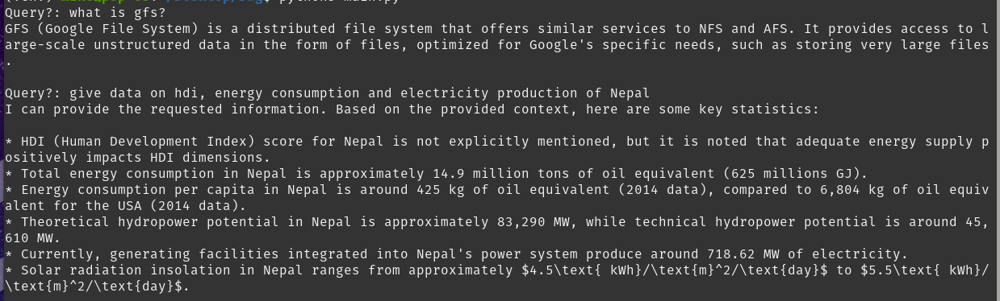

Man, I took so many notes in undergrad, it felt like they needed someone to chat with!

This is using Ollama as the inference engine, and it's running the llama3b: 4q_0 quantized version, which is pretty sleek for our needs. Langchain helps us with LLMish stuffs. And then there’s Chroma, which we use as a vector database to keep everything organized when retrieving data.

Shoutout to them:
https://arxiv.org/abs/2005.11401

## Prerequisites:

Requirements: 8GB RAM

Install ollama:
```
curl -fsSL https://ollama.com/install.sh | sh
```

To pull the required model using Ollama, use the command below:
```
ollama pull llama3
```

Test if the model is correctly installed and running by sending a request:
```
curl http://localhost:11434/api/generate -d '{
  "model": "llama3",
  "prompt":"Are you stupid?"
}'
```

Set up a virtual environment and activate it:
```
python3 -m venv .env
source .env/bin/activate
```

Install all the necessary Python packages from the requirements file:
```
pip3 install -r requirements.txt
```

Create a source_files directory and copy your notes or any other relevant files into it. Tru to make sure there are no spaces in the filenames as they may cause unexpected behavior:
```
mkdir source_files
cp <path_to_your_notes> source_files/
```

To load data into the vector store, run the loader script. If there are any changes in the source_files folder, rerun this command to update the vector store:
```
python3 loader.py
```

## Run the application:

To view the basic instructions and available command-line options for the application, use the --help flag:
```
python3 main.py --help
```

Execute the following command to run the application with RAG enabled. This is the default mode:
```
python3 main.py
```

If you wish to run the application without using RAG, you can disable it using the --no-rag flag:
```
python main.py --no-rag
```

## Examples:

I created a vector store using two of my notes: one on Big Data (which is quite technical) and another on Energy and Society (which is very specific). I wanted to compare the differences between Retrieval-Augmented Generation (RAG) and non-RAG outputs.



Llama3-8b didn't know about Google File System initially, but it was pretty updated on recent data.



After incorporating RAG, it now does! The insights from my notes are impressive, especially the exact state of energy data related to Nepal. I was quite surprised!



## TODO
I should definitely create a pretty interface once I finally learn web development!